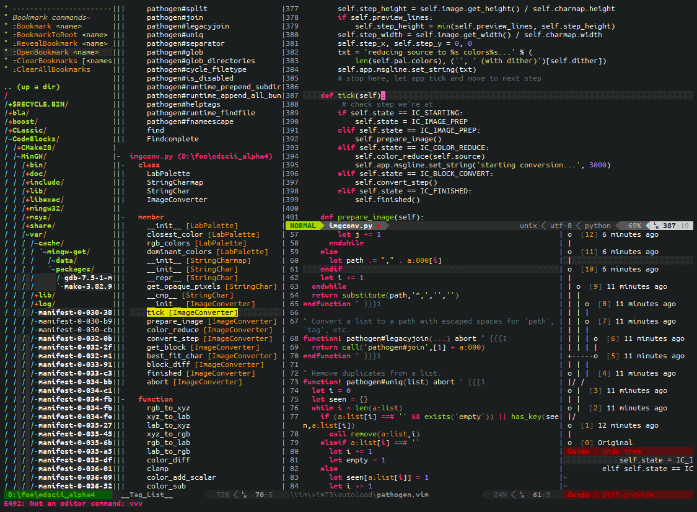

# Code nhanh hơn 30 lần với VimFast - rethinking how to use Vim

Sau khi đọc xong blog này, mọi người sẽ làm được như sau

## Giới thiệu

### Vim là gì?

> Vim là một **bộ tổ hợp phím tắt*** nhanh hơn bất cứ thứ gì bạn có thể tưởng tượng được.

> Vim cho phép bạn đạt đến cảnh giới *coding at the speed of thought*. Bạn đưa mắt tới đâu, code sẽ tự chỉnh sửa theo ý muốn của bạn.

**khoan hãy ném đá 🙃, ở đây mình sẽ định nghĩa theo cách mà cách bạn NÊN tiếp cận, nhìn nhận Vim như thế nào, còn chi tiết mình sẽ giải thích ở phần sau*

### Why Vim?

1. Kết hợp với Github Copilot, trở thành 1 bộ đôi hủy diệt.
        
    Với sự phát triển của ChatGPT và Github Copilot (hoặc các tool AI gen code tương tự) như hiện tại, phần lớn thời gian chúng ta dành để chỉnh sửa code. Vim sẽ tập trung vào chỉnh sửa code, còn Github Copilot sẽ có nhiệm vụ là gen code. Vì vậy, khi thành thạo thứ này, không còn gì có thể ngăn cản bạn code nữa. Bạn sẽ đạt tới cảnh giới cuối cùng: nháy mắt lần 1 code tự hiện ra, nháy mắt lần 2 code tự refactor theo ý muốn của bạn, nháy mắt lần 3 bug tự fix chính nó.
    

2. Vì là bộ tổ hợp phím tắt*

    nên có thể dùng trên bất cứ nền tảng nào như VSCode, Intelji Ultimate/Community, …

### Misconception về Vim - learning curve

bình thường thì mọi người sẽ hiểu là learning curve của vim sẽ như thế này

và bộ phím tắt là nhiều vô kể

nhưng thực chất là điều này phụ thuộc phần lớn tùy vào config của từng người dùng và thời gian họ bỏ ra để config các phím tắt đó. Như bộ config của mình thì learning curve sẽ như thế này:

và mình chủ yếu dùng đi dùng lại **không quá 8 phím tắt**. Các bạn chỉ mất **10-20 phút** để đuổi kịp tốc độ dùng IDE thông thường.

### Vim vs IDE (VSCode, Intelji Ultimate/Community, Atom, …)

Hồi các bạn mới vào gõ máy tính thì các bạn gõ trên Word, sau đó thì các bạn biết đến notepad, và rồi Netbean khi các bạn bắt đầu code java. Bạn nào code web hoặc data science thì bây giờ dùng VSCode hoặc java backend thì thường dùng Intelji Ultimate.

Vim ra đời là 1 cái text editor rất cổ từ năm 1991. Thì vim nguyên gốc là dùng trên terminal, hay một số bạn nghe là console ấy.

Nhưng mà kiểu đấy **hardcore** lắm, bạn nào thấy thú vị thì tự tìm hiểu thôi. **Mình không khuyến khích các bạn dùng vim trên terminal**, mà chỉ nên dùng vim dưới dạng plugin trên vscode hoặc intelji thôi.

Thì ở trên VSCode hay intelji thì họ đều có extension để giả lập *"bộ phím tắt vim"* vào. Như vậy, mình có thể sử dụng *tất cả tính năng* của VSCode hay Intelji mà vẫn có thể dùng các tính năng thường dùng sẵn có.

Chẳng hạn, mình rất hay dùng tính năng multi-cursor của VSCode kết hợp với các câu lệnh điều khiển của Vim.

## Phần chính

Không dài dòng nữa thì đây chính là bộ keybinding của mình

[https://github.com/thaiminhpv/fast.vim](https://github.com/thaiminhpv/fast.vim)

*Các bạn làm theo hướng dẫn cài đặt tại README.md*

Chỉ mất 2 phút để làm quen và 10 phút để "thành thạo" VimFast

### Vim for absolute beginner

*(~10 mins) - Bạn nào đã biết cơ bản vim rồi thì có thể skip qua phần này*

Để bắt đầu, các bạn sẽ cần hoàn thành [vimtutor](https://gist.github.com/hashrocketeer/852a4f878acd42abbf98f18278329bdc). Các bạn cài [Vim Plugin trên VSCode](https://marketplace.visualstudio.com/items?itemName=vscodevim.vim), tải file [này](https://gist.github.com/hashrocketeer/852a4f878acd42abbf98f18278329bdc) về và mở ra làm theo hướng dẫn.

Các bạn làm từ mục 1 đến 4.3, cộng thêm phần 6.1 và 6.2 là đủ để  qua phần VimFast bên dưới rồi.

Bạn có thể  xem video [này](https://www.youtube.com/watch?v=WD9CvdIAflY) của anh Phạm Huy Hoàng (Tôi đi code dạo) để dễ dàng hoàn thành vimtutor một cách trực quan hơn.

### VimFast

Các bạn tưởng tượng quy trình sẽ như thế này:

1. Các bạn Ctrl + U, Ctrl + D để thay cho cuộn chuột lên xuống.
2. Khi **dòng bạn muốn sửa** nằm trong màn hình của bạn, sử dụng `số + j/k` để đi tới đó.
3. nhấn `cb`/`c'`/`cl`/`cq`/`cd`, tùy bạn muốn chỉnh sửa ở đâu.

https://github.com/thaiminhpv/blogs/assets/48098520/426ec59e-d565-49f6-8312-a059bf97d97c

`b` là "bracket" hay `(`, `)`

`l` là `"`

`q` là `{`, `}`

`d` là `[`, `]`

Chúc các bạn thành công!
